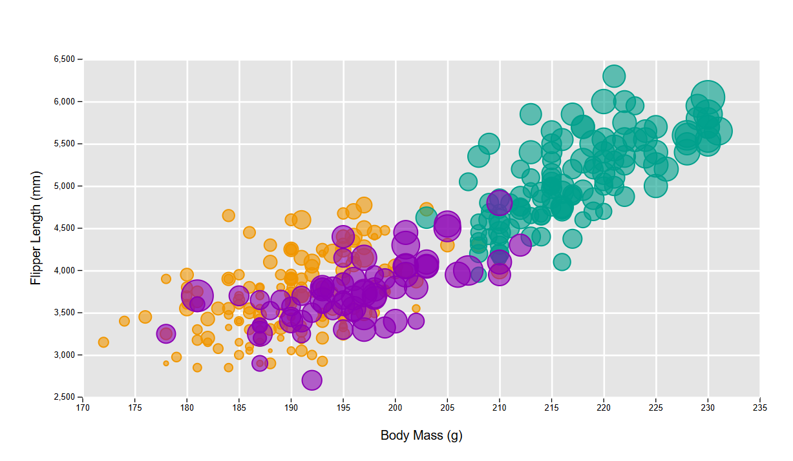
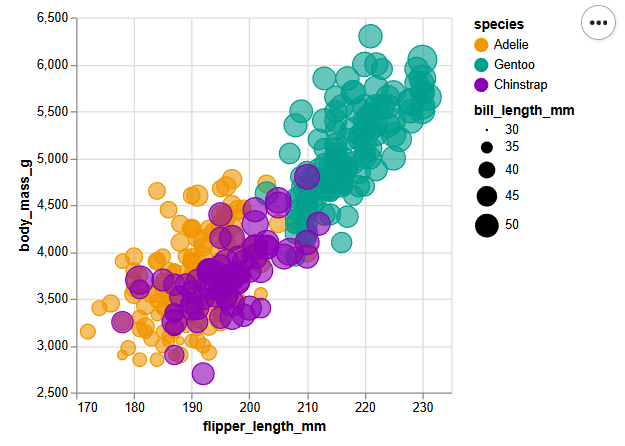
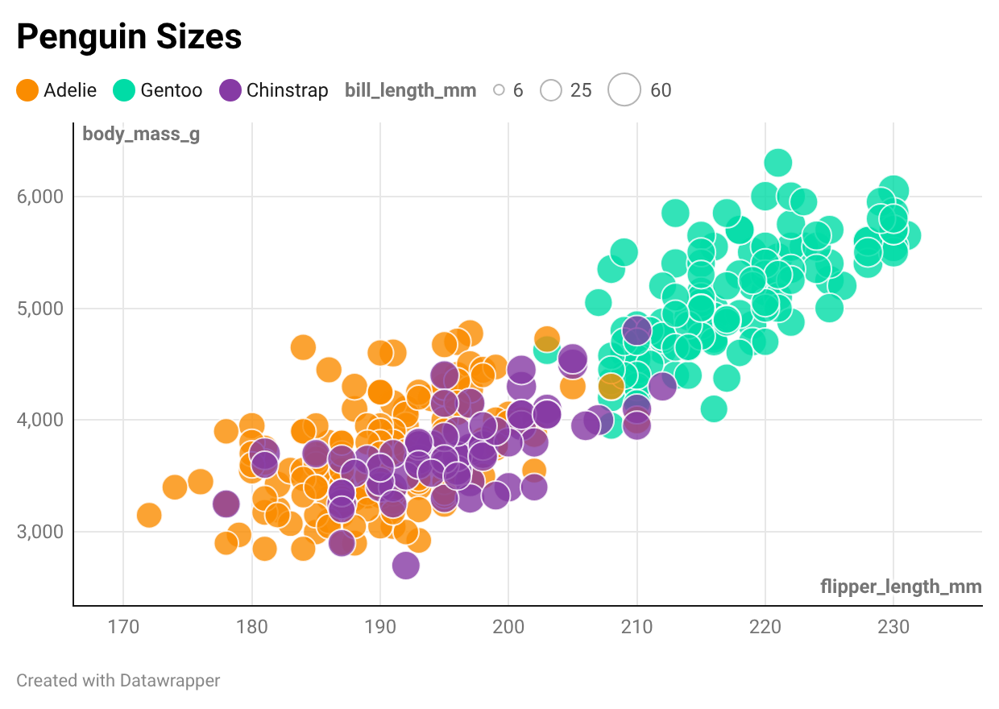
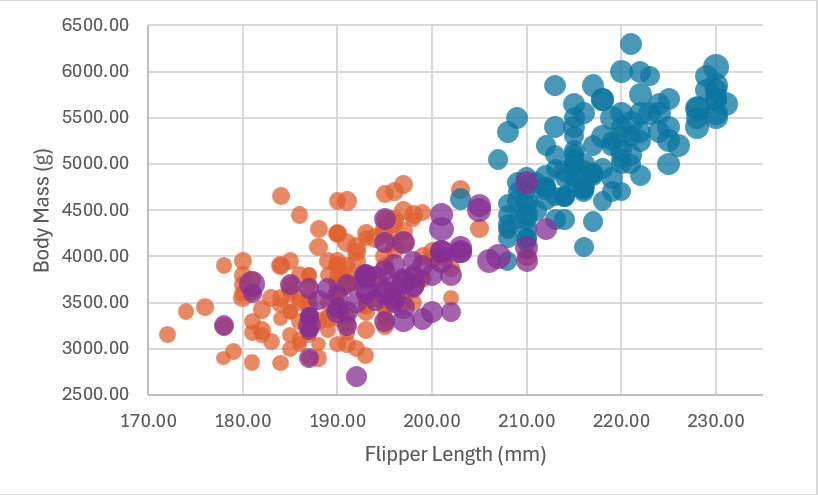

# Matlab

Matlab is a language commonly used by engineers to run matrix math, data analysis, and algorithms.

To visualize the Penguins dataset, I filtered the dataset into three parts by species and plotted each using the bubbleplot function. I then applied various functions to add colors, opacity, and the legends.

All the code was written by me, taken directly from the matlab documentation, or in the case of the file import, generated by matlab itself.

# d3

d3 is the main language we are using in this class for data visualization.

For visualization, I worked from a couple of d3 examples and heavily modified the code to add colors, background, and edit the axes to match the expected graph.

https://observablehq.com/@d3/bubble-chart/2
https://observablehq.com/@d3/scatterplot/2

# Altair

Vega-Altair is a popular python library for data visualization.

I started with the built-in bubble chart example, before modifying all the data streams to pull from the penguins data and adding custom colors and opacities.

https://altair-viz.github.io/gallery/bubble_plot.html

# Datawrapper

Datawrapper is a dedicated visualization tool that uses visual interfaces to create graphs. 

I started by importing my data and selecting the rows to visualize, before selecting the bubble chart option and modifying the colors, axis limits, and opacity to match the original graph.

The one difficulty I had was that the bubble sizes were not very controllable. I made them display as wide a range of values as possible, but I was not able to change the maximum and minumum sizes of the bubbles themselves.

# Excel

Excel is a spreadsheet program usually used for analyzing and visualizing data.

I started with a standard bubble chart created from the important data in the CSV. I made a separate series in the graph for each species. Then I changed the axes and added custom colors and opacities for each species.

## Technical Achievements
- **Added the legends in most of the visualizations**: I could not figure out how to make d3 or excel generate the legends in the way I wanted, but managed to make my matlab code implement it, which it doesn't normally generate.

### Design Achievements
- **Consistent Colors**: I used consistent colors throughout my graphs, in everything except excel, which was using its own colors.

- **Point Strokes**: I used full opacity strokes on all the graphs to help viewers identify individual points within the graphs.